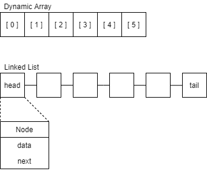
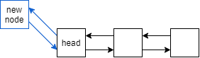
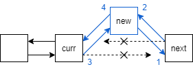

## Introduction

Linked lists are a non-contiguous list of items. This means that its items are not adjacent to another in memory. Linked lists are made up of nodes that contain the data and a reference to the next node in the list. Because items in a linked list do not reside next to each other in memory, they cannot be accessed by index. Instead, you must start at the head (the first item) of the list and traverse each link until you find the desired item.




## Singly and Doubly Linked Lists

A singly linked list only has links going in one direction. Each node has one reference to the next item in the list, meaning that you must always start at the head and end at the tail.

A doubly linked list has two references, both to the previous node and to the following node. This allows you to traverse the list both backwards and forwards, starting at the head or the tail.


## Traversing and Modifying

Here's some **Python** code we can use to print out the values of each item in the linked list. Don't worry, later on we'll take a look at how our linked list class is made!

```py
# Get a reference to the first item in the list.
node = linked_list.head

# Start the loop.
while node is not None:
    # Print out the data contained in the node.
    print(node.data)
    # node.next refers to the next node in the list. We'll assign it
    # to our current node variable to continue traversing the list.
    node = node.next
```


## Efficiency

Let's compare the efficiency of linked lists to a regular dynamic array:

|                   | Dynamic Array | Linked List |
| ----------------- | :-----------: | :---------: |
| Access element    |    `O(1)`     |   `O(n)`    |
| Add/remove middle |    `O(n)`     |   `O(1)`    |
| Add/remove end    |    `O(1)`     |   `O(1)`    |

Both types of lists have their pros and cons. Dynamic arrays give you immediate access to its elements, but it's slower at modifying them since removing or adding an element to the middle requires shifting other elements to the right. Linked lists require you to traverse each element from either the head or the tail, but you can easily remove or add a new element at any position in the list.


## Expanding your linked list

Adding a node to the head (or tail) is relatively simple. After creating the new node, you need to connect it to the current head node, and then connect the head node back to the new node. Finally you need to point the head reference to the new node so it can be used as the new starting point.



```py
# Adding a new head
node = LinkedList.Node(data)

node.next = self.head
self.head.prev = node
self.head = node
```

Adding a node to the middle of the linked list isn't too much harder. It just requires you to connect the new node to the nodes on the right and the left. In the code below, `curr` will be our reference to the current node and `new` will be the reference to the new node we're adding. First we need to connect the new node to the right node (`curr.next`). Second, we connect our right node back to the new node. This is probably the trickiest line since we only have a reference to our current (left) node. The code `curr.next.prev` goes from the current node to the next node (the right one) and then modifies the previous node reference. Third, we link our current node to the new node, and finally we link our new node back to the current node.



```py
# Adding a new node to the middle of the list
new = LinkedList.Node(data)

new.next = curr.next # 1
curr.next.prev = new # 2

curr.next = new # 3
new.prev = curr # 4
```

Be extra careful to make the connections are made in the right order, otherwise you can overwrite the connection between both sides of the list.


## Practice

Let's work on our linked list Python class! You'll notice that the `LinkedList` has an inner class, `Node`, which will handle the data and connections for each individual node. Some of the functions we need have already been implemented, such as `add_at_head()` which will add a Node to the beginning of the list. There are a few more function that need to be completed before our linked list is ready to go. In the space below, implement the following functions:
- `add_at_tail()` - Add a new node to the tail of the linked list.
- `add_before()` - Find the first occurrence of a value in the list and insert a node immediately before it.
- `replace()` - Find the first occurrence of a value and replace it with new data.
- `remove()` - Remove a node from the linked list.

<textarea>
class LinkedList:

    # The linked list has a node as an inner class.
    class Node:
        def __init__(self, data):
            # Initialize the data for the node.
            self.data = data
            # The node starts off without any connections.
            self.next = None
            self.prev = None

        def set_data(self, data):
            self.data = data

    def __init__(self):
        # The linked list starts out without a head or tail.
        self.head = None
        self.tail = None

    def add_at_head(self, data):
        # Create the new node.
        node = LinkedList.Node(data)

        if self.head:
            # 1. Connect the new node to the old head node.
            node.next = self.head
            # 2. Connect the old head node back to the new node to doubly link it.
            self.head.prev = node
            # 3. Point the head reference to the new node.
            self.head = node
        else:
            # If the linked list has no head, it has no tail either. Set both to the new node.
            self.head = node
            self.tail = node

    def add_at_tail(self, data):
        # (The add_at_head function should help).
        ...

    def add_after(self, value, data):
        for node in self:
            if node.data == value:
                if node == self.tail:
                    # If our target value is at the tail, call the regular add_at_tail function.
                    self.add_at_tail(data)
                else:
                    # Create the new node.
                    new_node = LinkedList.Node(data)
                    # Connect the new node to the node on the right (node.next).
                    new_node.next = node.next
                    node.next.prev = new_node
                    # Connect the new node to the node on the left (node).
                    node.next = new_node
                    new_node.prev = node

                # We only want to insert after the first value.
                break

    def add_before(self, value, data):
        # (The add_after function should help).
        ...

    def remove_head(self):
        self.head = self.head.next
        self.head.prev = None

    def remove_tail(self):
        self.tail = self.tail.prev
        self.tail.next = None

    def remove(self, value):
        # Remove the first occurrence of a value.
        ...

    def replace(self, value, data):
        # You may want to make use of the set_data function within the Node class.
        ...

    def __iter__(self):
        # Iterate through the linked list.
        node = self.head
        while node is not None:
            yield node
            node = node.next

    def __reversed__(self):
        node = self.tail
        while node is not None:
            yield node
            node = node.prev

    def __str__(self):
        data = [str(node.data) for node in self]
        return f"[{' -> '.join(data)}]"


linkedlist = LinkedList()
linkedlist.add_at_head(1)
linkedlist.add_at_head(2)
linkedlist.add_at_head(3)
linkedlist.add_after(2, 6)
linkedlist.add_after(3, 7)
linkedlist.remove_head()
# Uncomment the tests below after you have implemented the functions.
# linkedlist.add_at_tail(4)
# linkedlist.add_at_tail(5)
# linkedlist.add_before(5, 8)
# linkedlist.replace(2, 9)
# linkedlist.remove(1)

print(linkedlist)
# Shoudl print: [7 -> 9 -> 6 -> 4 -> 8 -> 5]

# Using the __reversed__ method.
print("Reversed:")
for node in reversed(linkedlist):
    print(node.data)
</textarea>


## Problem

<textarea>
# Write your code here!
</textarea>

<details><summary markdown="span">See the solution!</summary>

```py

```

</details>

---

### Keep on learning!

Linked lists can be tricky. Lots of people can't make **head or tail** out of them, so way to go for making it his far!

The next lesson is on [Trees](trees.md)!

Or review the last lesson, [Stacks](stacks.md)!

<!-- Primary Color: #0F60D0 -->