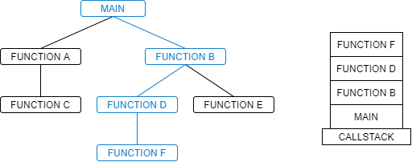

## Introduction

Stacks are a type of dynamic array that only gives the user access to the top element.


## Pushing and Popping

The functions used for modifying the top element of a stack are called `push` and `pop`.


Python uses the `append()` function for pushing an item to the top of the stack.

```py
stack = []

stack.append(1)
stack.append(2)
stack.append(3)

print(stack)
# [ 1, 2, 3 ]
```

The `pop()` function removes the top item and returns its value, allowing you to store the popped value in another variable. In the example below, the values popped from the stack are returned to the `print()` function and displayed.

```py
print(stack.pop())  # 3
print(stack.pop())  # 2
print(stack.pop())  # 1
```


## Application – Keeping things in order

Stacks are really good at keeping things in order. For example, when you're writing code in your code editor and you make a mistake, you can hit Ctrl Z to undo, and that's because all of your changes are saved on a stack. The editor knows the order of all the actions you performed, so undo-ing an action basically removes it from the stack.

Another good example of how stacks are used is the CallStack. The CallStack keeps track of the state of the program as functions are called, meaning that the values of the variables within that function's scope are saved. Take a look at the diagram below, which shows a structure chart for a program. If you want to call `Function F`, you first have to call `Function B` and `Function D`.



As each function is called, it is added to the CallStack. When a function finishes or returns a value, it pops the top function off the CallStack and reverts to the previous program state. The CallStack comes especially in handy when debugging. If an error occurs in one of your functions, the CallStack can tell you which functions were called to reach that point, making it much easier to track the source of the error.


## Efficiency

Pushing and popping from the stack doesn't require any shifting of the data in the dynamic array. The top item is only ever accessed, which means modifying the stack has an efficiency of `O(1)`. 


## Example – Reversing items

Because items are popped from the stack in the opposite order that they are pushed, stacks can be useful for reversing the order of a list.

```py
stack = list("Word")
word_reversed = ""
while len(stack) > 0:
    word_reversed.append(stack.pop())

print(word_reversed)
# "droW"
```

## Problem to Solve

<textarea>
# Write your code here!
stack = []
</textarea>

<details><summary markdown="span">See Solution</summary>

```py
stack = []

stack.append(1)
stack.append(2)
stack.append(3)
three = stack.pop()
two = stack.pop()
one = stack.pop()
print(one, two, three)
```

</details>

<!-- Primary Color: #0F80D0 -->