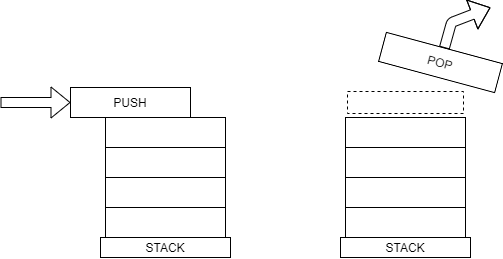

## Introduction

Stacks are a type of dynamic array that only gives the user access to the top element.


## Pushing and Popping

The functions used for modifying the top element of a stack are called `push` and `pop`.



Python uses the `append()` function for pushing an item to the top of the stack.

```py
stack = []

stack.append(1)
stack.append(2)
stack.append(3)

print(stack)
# [ 1, 2, 3 ]
```

The `pop()` function removes the top item and returns its value, allowing you to store the popped value in another variable. In the example below, the values popped from the stack are returned to the `print()` function and displayed.

```py
print(stack.pop())  # 3
print(stack.pop())  # 2
print(stack.pop())  # 1
```


## The Call Stack
## Efficiency
## Example – Reversing items

Because items are popped from the stack in the opposite order that they are pushed, stacks can be useful for reversing the order of a list.

```py
stack = list("Word")
word_reversed = ""
while len(stack) > 0:
    word_reversed.append(stack.pop())

print(word_reversed)
# "droW"
```

## Problem to Solve

<!-- <pre> -->
<textarea width=100%></textarea>
<!-- </pre> -->

<details><summary markdown="span">See Solution</summary>

```py
stack = []

stack.append(1)
stack.append(2)
stack.append(3)
three = stack.pop()
two = stack.pop()
one = stack.pop()
print(one, two, three)
```

</details>
