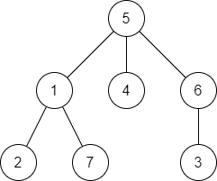
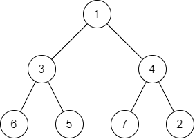
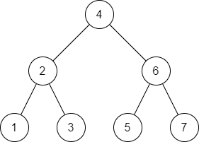
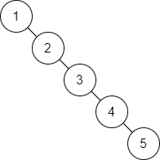

## Introduction

Trees are very useful data structures that are composed of parent and child nodes. They are quite similar to linked lists, since the nodes don't exist next to each other in memory. They are called trees because they start out with a root node, and they branch out and expand the deeper you go.


## Types of Trees

There are many types of trees, but we will talk about three common ones in this tutorial: General Trees, Binary Trees, and Binary Search Trees

### General Trees
No constraints on number of children or sorting.



### Binary Trees
Each node can have only two children. No constraints on sorting.



### Binary Search Trees
Each node can have only two children, with smaller nodes sorted to the left and larger nodes sorted to the right.




## Traversing with Recursion

Because trees are not linear like arrays or linked lists, we need to take a different approach to how we traverse them. The solution is **recursion**! If you're not familiar with recursion, it involves a function calling itself repeatedly until an action is performed or a piece of data is found. Let's take a look at the Binary Search Tree (BST) above. Since the BST follows the rules of smaller nodes on the left and larger nodes on the right, we can use that to our advantage as we search through our tree.

Let's say we want to check if our tree contains the number 3. Starting at our root node, we see it has the value of 4. Since the value we're searching for is less than 4, we know that it will be on the left side of our root node. And so we call the search function on the left node. On the second iteration of our search, we go through the same process. The value of our node is 2, and the node we're searching for is greater, so we know it will be on the right. We call the search function once again on the right node. The value of the node is 3, which is the value we're searching for, so we can return True.

If we were to search for the number 0 in our tree, we would go from 4 to 2 to 1. At that point, we would know that the value does not exist because 0 should be to the left of 1, but 1 does not have a left node, so we would return False. Later on we'll look at how this can be implemented using a Python class.


## Efficiency

The efficiency of searching and adding to a BST is `O(log n)`. If you're like me and you hated logarithms in math class, then no worries, it's actually pretty simple. After each iteration of the search, the number of nodes we have to look through is divided by half! Remember inked lists are `O(n)` for searching because we have to go through every node. With the BST we basically know the shortcut to get to the node we want!

If we had a linked-list with 1000 nodes and we wanted to get to the 617th node (assuming they're sorted with the numbers 1-1000), how many iterations would it take? 617.

If we had a tree with 1000 nodes in it (with 1000 sorted numbers as well), how many iterations would it take to find the 617th node? Let's do some math:

| Iteration | Current Node |  L/R?  |
| :-------: | :----------: | :----: |
|     1     |     500      |   R    |
|     2     |     750      |   L    |
|     3     |     625      |   L    |
|     4     |     562      |   R    |
|     5     |     593      |   R    |
|     6     |     609      |   R    |
|     7     |     617      | Found! |

Wow! Check it out. After just 7 iterations we found the node we were looking for! `log base 2 of 1000` is equal to about 10, which means that it will take *at most* 10 iterations to find any given number in our tree! How's that for efficiency? The great thing about it is that we could double the size of our tree, and it would only add 1 to the number of iterations. This makes BST's *extremely* efficient!


## Balanced Trees

Inserting new nodes into the tree follows a similar recursion process as our search function. The value we want to add gets passed down to the left or right depending on its value, and once we get to an empty branch, we add the new node at the end. This can cause problems, however, if the nodes being inserted are already in sorted order. Look at the diagram below. If we insert our nodes in the order `1, 2, 3, 4, 5`, the new nodes will always be placed on the right, and at this point it's basically a linked list.



A balanced tree generally has the same number of nodes on both sides of the tree at any given position, such as this example we saw earlier.


There are several balancing algorithms commonly used for Binary Search Trees, such as AVL trees and Red-Black trees. We won't cover these topics here, but feel free to research them on your own!


## Practice

Here's part of the Python code that we'll use in our BST class for adding new nodes:

```py
class BST:

    ...

    def add(self, data):
        if self.root:
            self._add_recursive(self.root, data)
        else:
            self.root = BST.Node(data)

    def _add_recursive(self, node, data):
        if data < node.data:
            if node.left:
                self._add_recursive(node.left, data)
            else:
                node.left = BST.Node(data)

        elif data > node.data:
            if node.right:
                self._add_recursive(node.right, data)
            else:
                node.right = BST.Node(data)

    ...

```

Let's see if you can fill in this BST based on the code given below. Use the text area below, or draw it out by hand if you want! Look at the code carefully. In the test code below there are several duplicate values. Notice that there is an `add` function that will be called by the user. There is also an `_add_recursive` function that will recursively add the node at the correct position in the tree. Try to figure out what will happen when duplicate values are added to the tree.

```py
bst = BST()
bst.add(25)
bst.add(2)
bst.add(34)
bst.add(16)
bst.add(47)
bst.add(51)
bst.add(7)
bst.add(16)
bst.add(22)
bst.add(34)
bst.add(42)
bst.add(8)
```

<textarea>
        25
      /    \
    2
</textarea>

<details><summary markdown="span">See the solution!</summary>

Here's our final tree! How did you do?

```py
        25
      /    \
    2        34
     \         \
      16        47
     /  \      /  \
    7    22  42    51
     \
      8
```

Notice that none of the duplicate values were inserted. This is because the `_add_recursive` function only tested to see if the new data was higher or lower. If a duplicate value is entered, the function simply does nothing.

</details>

## Problem

Before getting into this problem, let's talk a bit more about recursion. As mentioned earlier, recursion involves a function calling itself repeatedly until an action is performed or a piece of data is found. A recursive function needs a base case, or a point in the program where the recursion knows to stop. Otherwise the function will keep calling itself forever.

Let's implement the code for finding an item in the tree. The `find` function is already written. You will need to fill in the `_find_recursive` function. It may be easiest to copy this code into your editor to test it out.

<details><summary markdown="span">Hint!</summary>

There should be two base cases
- The node does not exist: returns `False`
- The data is found: returns `True`

Otherwise, you will need to continue making recursive calls. Call the function again with either the left or the right node. You will need to return the result as well so that `True` or `False` can be passed all the way back up the recursive chain.

</details>

```py
class BST:

    def __init__(self):
        self.root = None

    class Node:

        def __init__(self, data):
            self.data = data
            self.left = None
            self.right = None

    def add(self, data):
        if self.root:
            self._add_recursive(self.root, data)
        else:
            self.root = BST.Node(data)

    def _add_recursive(self, node, data):
        if data < node.data:
            if node.left:
                self._add_recursive(node.left, data)
            else:
                node.left = BST.Node(data)

        elif data > node.data:
            if node.right:
                self._add_recursive(node.right, data)
            else:
                node.right = BST.Node(data)

    def find(self, data):
        return self._find_recursive(self.root, data)

    def _find_recursive(self, node, data):
        ...

    def _display_recursive(self, node):
        if node:
            self._display_recursive(node.left)
            print(node.data)
            self._display_recursive(node.right)

    def __str__(self):
        self._display_recursive(self.root)
        return ''

# Here's a bit of test code
bst = BST()
bst.add(4)
bst.add(2)
bst.add(6)
bst.add(1)
bst.add(3)
bst.add(5)
bst.add(7)
print(bst.find(3))  # Should print True
print(bst.find(0))  # Should print False
print(bst.find(6))  # Should print True
print(bst.find(8))  # Should print False

```

<details><summary markdown="span">See the solution!</summary>

```py
    def _find_recursive(self, node, data):
        if node is None:
            return False

        if data == node.data:
            return True

        if data < node.data:
            return self._find_recursive(node.left, data)

        if data > node.data:
            return self._find_recursive(node.right, data)
```

</details>

---

### Keep on learning!

You've completed the final lesson in this set of tutorials, but I hope you continue to **branch** out and learn more about data structures!

Feel free to review the previous lessons on [Stacks](stacks.md) and [Linked Lists](linked_lists.md)!

<!-- Primary Color: #0F60D0 -->